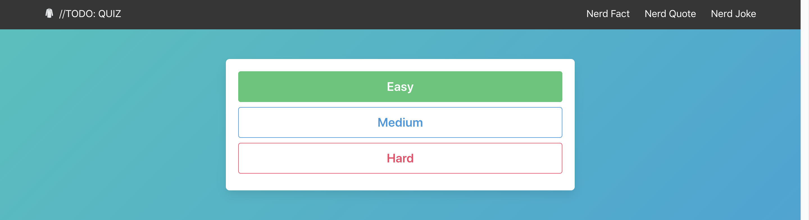
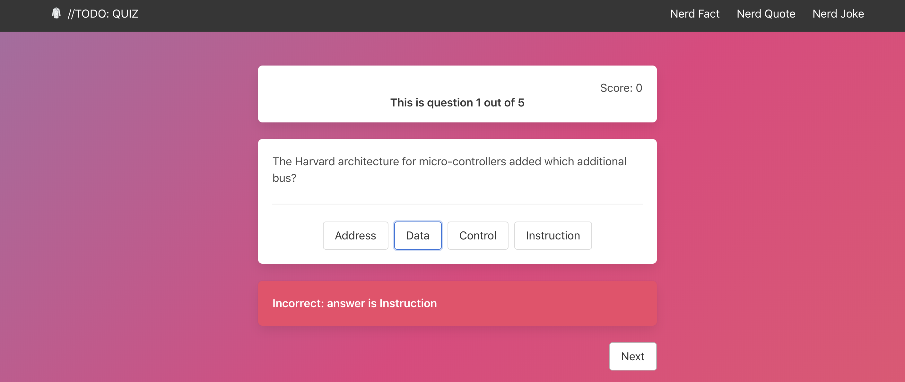
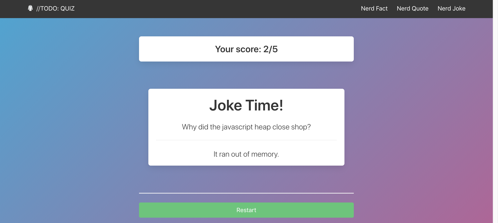

# Software Engineering Immersive: Project 2

Second project undertaken during the General Assembly Software Engineering Immersive course (week 6).

---

# //TODO Quiz

This is a website built using a quiz API. The user can select difficulty and then will answer 5 questrions about computing. The project was a pair coding project and my partner was [Astara Cambata](https://github.com/astara303/) and the project was completed in 48 hours.

## Brief

Build a react app that:

* **Consume a public API** – this could be anything but it must make sense for your project.
* **Have several components** - At least one classical and one functional.
* **The app should include a router** - with several "pages".
* **Include wireframes** - that you designed before building the app.
* Have **semantically clean HTML** - you make sure you write HTML that makes structural sense rather than thinking about how it might look, which is the job of CSS.
* **Be deployed online** and accessible to the public.

## Deployment

The app is deployed using Heroku and can be found [here](https://jmr-sei-project-2.herokuapp.com/).

## Getting Started

Use the clone button to download the game source code. In the terminal enter the following commands:

```
<!-- To install all the packages listed in the package.json: -->
$ npm i
<!-- Run the app in your localhost: -->
$ npm run serve
<!-- Check the console for any issues and if there are check the package.json for any dependancies missing  -->
```

## Technology Use

* Coding Technology
  * React
  * Node.js
  * Express
  * Axios
  * Bulma
  * SCSS
  * Git
  * GitHub
* API Technology
  * Open Trivia Database API - [documentation](https://opentdb.com/api_config.php)
  * Number Face API - [documentation](http://numbersapi.com/#url-structure)
  * Programming Quote API - [documentation](https://programming-quotes-api.herokuapp.com/)
  * Joke API - [documentation](https://sv443.net/jokeapi)

## Timeframe

Coding was done over 2 days. Deadline for the project was 3pm on the 24th of January 2020.

## Project Overview

### Open Trivia DB API

Due to the limited time frame to complete the project, we wanted to find an API that didn't need tokens or authentication that would need approval. Open Trivia DB allows you to get quiz questions based on a category, difficulty and question type through the URL.

### Homepage

The homepage was a simple function compondant with a bulma hero background image. We wanted to keep the homepage routed to / and simple so that we could build more than just the quiz into the app. If we started on the quiz page that was all the app would be but starting on the homepage means we were able to easily add in three other seperate API compondents without messing up the gameplay.

### Game Play

The game play component is split into three section depending if certain values are truthy or falsey in the state. 

The first section is the difficulty section. When a user pressed on of the buttons the state.difficulty is changed. When the component rerenders, this section will disappear due to ```!this.state.difficulty``` now being false



The second section is the gameplay. This section appears difficulty is now a truthy value ```this.state.gamePlaying && this.state.difficulty```
The questions have already been pulled from the api when the Start.js mounted and they have been randomised. This section will loop through the array until the user gets to question 5.



Once question 5 has been answered, this.state.gamePlaying is changed to false. That activates the ResultPage component which pushing the prop of score from state.
```js
!this.state.gamePlaying && <ResultPage score={this.state.score}
```
The results page shows the score, gets a joke as a reward from the Joke compondent and has a reset button that links the used back to / from /quiz.



### Secondary APIs

#### Numbers API

The number API is a url api that has many used but we used the http://numbersapi.com/random/trivia/ url to a get one fact about numbers that would refresh every render.

The data was returned as a txt file with the whole txt response being set in state.

#### Programming Quote API

The programming quote api is a url api gets a get request and sends an object with quote, author and source. Call are made to https://programming-quotes-api.herokuapp.com/quotes/random/lang/en. There was three states within our object for each of the three keys that were sent.

#### Computer Joke API

The computer joke API had is a URL based API that either gives you a one key object of joke or a two key object of setup and delivery. Instead to changing the state based on whether we were sent a one to two line joke, state started with all three keys but only show each if it was a truthy value. 

One issue with this api was the content of some of the jokes. To counter this there was a ?blacklistFlags=nsfw,religious,political parameter that was added to remove religious, political and not safe for work content.

## Reflection

### Wins

The MVP app that was created in two days was finished with a working quiz and 3 other API intergations.
Using Bulma has meant the app looks professional with minimal hardcoded CSS.

### Challenges

The OpenTDB Api sends requests via a urlencoded string. This meant that special characters were changed and made the game unreadable. The first option with trying to fix this was to write a large regex replace function. On further review this did not seem like the best option as human error in writing the regex could break the string.
The option was ended up with was requesting the API calls in base64. When we displayed any value, we would convert the base64 to readable tewxt using the method atob()

```js
//Displaying the question
window.atob(this.state.questionObj.question)

//Displaying the answers
window.atob(answer)

//Showing the correct answer
window.atob(this.state.questionObj.correctAnswer)
```

As we were using the e.target.value to check which button the user has click, we have to use btoa() when comparing if the answer was correct.
```js
if (window.btoa(e.target.textContent) === this.state.questionObj.correctAnswer) {
```

### Future Improvements

Currently the game is only pulling from one category in the OpenTDB API limiting the amount of questions that can be asked. Future version should have either a selection of categories or a more diverse question range.

Adding a time limit on each question would add to the gameplay.

Adding a highscore that is saved on locate storage.